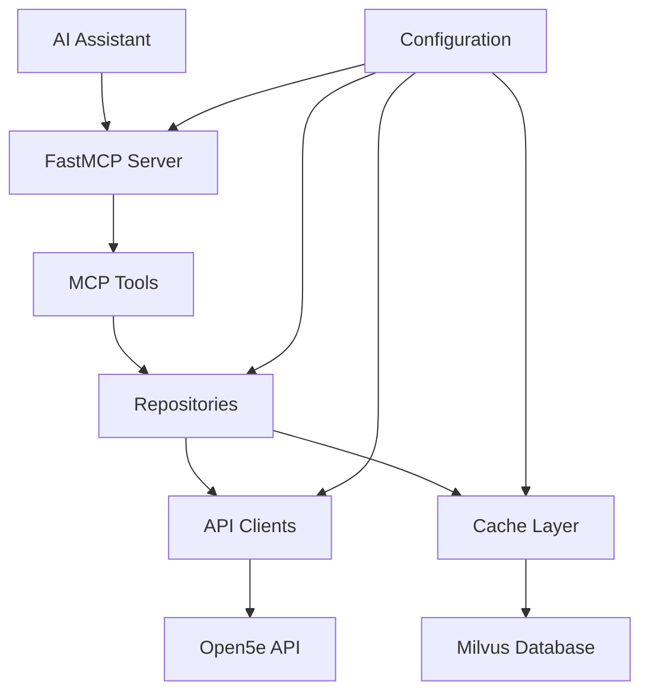

# Architecture Documentation

This document describes the architecture and design decisions behind the LoreKeeper MCP project.

## Table of Contents

- [Overview](#overview)
- [Architecture Principles](#architecture-principles)
- [System Architecture](#system-architecture)
- [Component Design](#component-design)
- [Data Flow](#data-flow)
- [Design Decisions](#design-decisions)
- [Performance Considerations](#performance-considerations)
- [Scalability Considerations](#scalability-considerations)
- [Security Considerations](#security-considerations)
- [Repository Pattern Architecture](#repository-pattern-architecture)

## Overview

LoreKeeper is a Model Context Protocol (MCP) server that provides AI assistants with access to comprehensive Dungeons & Dragons 5th Edition data. The system is designed around performance, reliability, and maintainability principles.

### Key Requirements

- **Fast Response Times**: AI assistants need quick access to game data
- **High Reliability**: System must be dependable for interactive sessions
- **Data Freshness**: Game data should be reasonably up-to-date
- **Extensibility**: Easy to add new data sources and tools
- **Type Safety**: Catch errors at development time rather than runtime

## Architecture Principles

### 1. Async-First Design

All I/O operations use async/await patterns to ensure non-blocking behavior:

```python
async def lookup_spell(name: str) -> dict[str, Any]:
    # Check cache first
    cached = await get_cached(cache_key)
    if cached:
        return cached

    # Fetch from API
    response = await http_client.get(url)
    data = response.json()

    # Cache for future use
    await set_cached(cache_key, data, "spell", ttl)
    return data
```

**Benefits**:
- Non-blocking I/O operations
- Better resource utilization
- Improved responsiveness
- Natural fit for FastMCP server model

### 2. Layered Architecture

The system follows a strict layered approach:

```
┌─────────────────────────────────────┐
│           FastMCP Server           │  ← MCP Protocol Layer
├─────────────────────────────────────┤
│         MCP Tools Layer           │  ← Business Logic Layer
├─────────────────────────────────────┤
│      Repository Layer             │  ← Data Access Abstraction Layer
├─────────────────────────────────────┤
│        API Client Layer           │  ← External Integration Layer
├─────────────────────────────────────┤
│         Cache Layer               │  ← Data Persistence Layer
├─────────────────────────────────────┤
│      Configuration Layer          │  ← Infrastructure Layer
└─────────────────────────────────────┘
```

**Benefits**:
- Clear separation of concerns
- Testability in isolation
- Easy to modify individual layers
- Consistent interfaces between layers

### 3. Cache-First Strategy

The system prioritizes cached data over fresh API calls:

```python
async def get_data(key: str) -> dict[str, Any]:
    # Always check cache first
    cached = await cache.get(key)
    if cached:
        return cached

    # Only fetch from API if cache miss
    fresh_data = await fetch_from_api(key)
    await cache.set(key, fresh_data, ttl)
    return fresh_data
```

**Benefits**:
- Dramatically reduced API latency
- Lower API rate limiting impact
- Better offline capability
- Reduced external dependency risk

### 4. Type Safety with Pydantic

All configuration and data structures use Pydantic models:

```python
class Settings(BaseSettings):
    milvus_db_path: Path = Field(default_factory=get_default_milvus_db_path)  # XDG path
    cache_ttl_days: int = Field(default=7, ge=1, le=365)

class Spell(BaseModel):
    name: str
    level: int = Field(ge=0, le=9)
    school: Literal["abjuration", "conjuration", ...]
```

**Benefits**:
- Compile-time error detection
- Automatic validation
- IDE support and autocomplete
- Self-documenting code

## System Architecture

### Component Interaction



### Data Flow Patterns

#### 1. Cache Hit Flow
```
AI Request → MCP Tool → Repository → Cache Check → Return Cached Data → AI Response
```

#### 2. Cache Miss Flow
```
AI Request → MCP Tool → Repository → Cache Check → API Call → Cache Storage → Return Data → AI Response
```

#### 3. Error Flow
```
AI Request → MCP Tool → Repository → Cache Check → API Error → Return Cached/Error → AI Response
```

## Component Design

### FastMCP Server Layer

**Responsibilities**:
- MCP protocol handling
- Tool registration and discovery
- Request routing
- Lifecycle management

**Key Design Decisions**:
- Use FastMCP framework for MCP compliance
- Async context manager for resource lifecycle
- Centralized error handling

```python
@asynccontextmanager
async def lifespan(app: Any) -> AsyncGenerator[None]:
    await init_db()  # Initialize database
    yield
    # Cleanup resources if needed

mcp = FastMCP(
    name="lorekeeper-mcp",
    version="0.1.0",
    lifespan=lifespan,
)
```

### MCP Tools Layer

**Responsibilities**:
- Implement specific lookup functionality
- Parameter validation
- Response formatting
- Cache integration

**Tool Categories**:
- `search_spell`: Spell information
- `search_creature`: Creature stat blocks
- `search_character_option`: Classes, races, backgrounds, feats
- `search_equipment`: Weapons, armor, magic items
- `search_rule`: Rules, conditions, references
- `search_all`: Unified cross-entity search

**Design Pattern**:
```python
@mcp.tool()
async def search_spell(
    name: str | None = None,
    level: int | None = None,
    school: str | None = None,
    # ... other parameters
) -> str:
    """Search and retrieve spell information."""

    # Get repository (dependency injection)
    spell_repo = RepositoryFactory.create_spell_repository()

    # Use repository for data access with built-in caching
    spells = await spell_repo.search(name=name, level=level, school=school)

    return format_spell_response(spells)
```

### Repository Layer

**Responsibilities**:
- Abstract data access patterns
- Implement cache-aside caching strategy
- Provide consistent interface for MCP tools
- Handle multi-source queries (aggregating from multiple APIs)
- Manage filter composition and transformation

**Repository Types**:
- `SpellRepository` - D&D 5e spells (uses Open5e v2 API)
- `CreatureRepository` - Creature stat blocks (uses Open5e v2 `/creatures/` endpoint)
- `EquipmentRepository` - Weapons, armor, magic items (uses Open5e v2 API)
- `CharacterOptionRepository` - Classes, races, backgrounds, feats (uses Open5e v1 API)
- `RuleRepository` - Rules, conditions, reference data (uses Open5e v2 API)

**Key Design Pattern - Cache-Aside**:
```python
class SpellRepository:
    """Repository for spell data with cache-aside pattern."""

    def __init__(self, client: SpellClient, cache: SpellCache):
        self.client = client
        self.cache = cache

    async def get_all(self) -> list[Spell]:
        """Retrieve all spells using cache-aside pattern."""
        # 1. Try to get from cache
        cached = await self.cache.get_entities("spell")
        if cached:
            return [Spell.model_validate(item) for item in cached]

        # 2. Fetch from API on cache miss
        spells = await self.client.get_spells()

        # 3. Store in cache
        spell_dicts = [s.model_dump() for s in spells]
        await self.cache.store_entities(spell_dicts, "spell")

        return spells

    async def search(self, **filters: Any) -> list[Spell]:
        """Search spells with filters using cache when available."""
        # Get all spells (cached)
        all_spells = await self.get_all()

        # Filter in-memory
        return self._apply_filters(all_spells, **filters)
```

**Repository Factory**:
```python
from lorekeeper_mcp.repositories.factory import RepositoryFactory

# Create repositories with dependency injection
spell_repo = RepositoryFactory.create_spell_repository()
creature_repo = RepositoryFactory.create_creature_repository()
equipment_repo = RepositoryFactory.create_equipment_repository()
character_repo = RepositoryFactory.create_character_option_repository()
rule_repo = RepositoryFactory.create_rule_repository()

# Override dependencies for testing
mock_cache = MockCache()
spell_repo = RepositoryFactory.create_spell_repository(cache=mock_cache)
```

**Benefits of Repository Pattern**:
- **Separation of Concerns**: MCP tools don't know about caching or API details
- **Testability**: Easy to mock repositories for unit testing tools
- **Flexibility**: Swap API clients or cache implementations without changing tools
- **Consistency**: All data access follows the same pattern (cache-aside)
- **Maintainability**: Changes to caching strategy only affect repository layer
- **Reusability**: Repositories can be used by multiple tools or external services

### API Client Layer

**Responsibilities**:
- HTTP communication with external APIs
- Request/response handling
- Error handling and retry logic
- Response normalization

**Design Considerations**:
- Single unified Open5e API client
- Consistent interface for all API calls
- Automatic retry with exponential backoff
- Rate limiting awareness

```python
class Open5eClient:
    def __init__(self, base_url: str, http_client: httpx.AsyncClient):
        self.base_url = base_url
        self.client = http_client

    async def get_spells(self, **params) -> dict[str, Any]:
        """Fetch spells from Open5e API."""
        url = f"{self.base_url}/v2/spells/"
        response = await self.client.get(url, params=params)
        response.raise_for_status()
        return response.json()
```

### Cache Layer

**Responsibilities**:
- Data persistence and retrieval with semantic search
- Vector/embedding storage for semantic matching
- Performance optimization

**Milvus Lite Features**:
- Embedded vector database (no external services)
- Semantic search via embeddings
- Hybrid search combining vectors and scalar filters
- Automatic embedding generation using sentence-transformers

### Configuration Layer

**Responsibilities**:
- Environment variable handling
- Default value management
- Validation
- Type conversion

**Design Features**:
- Pydantic Settings for automatic validation
- Environment file support
- Type-safe configuration
- Runtime configuration validation

## Design Decisions

### 1. Milvus Lite vs. External Cache

**Decision**: Use Milvus Lite instead of Redis or SQLite

**Rationale**:
- Semantic search capabilities built-in
- Embedded database (no external dependencies)
- Vector search enables natural language queries
- Hybrid search combines semantic + structured filtering
- Excellent Python support with pymilvus
- Single database for both data and embeddings

### 2. API Selection Strategy

**Decision**: Use Open5e API exclusively

**Rationale**:
- Open5e has comprehensive data for all categories
- Better structured responses
- Includes community content
- Single API source reduces complexity and maintenance burden
- Consistent behavior across all lookups

### 3. TTL Values

**Decision**: 7 days for normal data, 5 minutes for errors

**Rationale**:
- Game data changes infrequently (new books, errata)
- 7 days balances freshness with performance
- Errors should be cached briefly to allow quick recovery
- Manual cache invalidation available if needed

### 4. Async vs. Sync

**Decision**: Full async implementation

**Rationale**:
- Natural fit for I/O-bound operations
- Better resource utilization
- FastMCP server is async-based
- Future scalability for concurrent requests
- Modern Python best practices

### 5. Type Safety Level

**Decision**: Strict type checking with MyPy

**Rationale**:
- Catch errors at development time
- Better IDE support
- Self-documenting code
- Easier refactoring
- Reduced runtime errors

## Performance Considerations

### Cache Performance

**Optimizations**:
- Vector indexing for fast semantic search
- Scalar indexes on filter columns
- Efficient embedding generation with batching
- Lazy model loading

**Metrics to Monitor**:
- Semantic search latency
- Cache hit ratio (target: >80%)
- Embedding generation time
- Database size growth

### API Performance

**Optimizations**:
- HTTP/2 support with httpx
- Connection pooling
- Request timeout configuration
- Retry logic with exponential backoff

**Metrics to Monitor**:
- API response times
- Error rates
- Rate limiting encounters
- Timeout frequency

### Memory Usage

**Considerations**:
- Streaming large responses
- Efficient JSON parsing
- Connection pool sizing
- Cache size management

## Scalability Considerations

### Horizontal Scaling

**Current Limitations**:
- Milvus Lite file-based storage (not suitable for multi-instance)
- In-process cache (no distributed caching)

**Future Enhancements**:
- Milvus cluster for multi-instance deployments
- Redis for distributed session caching
- Load balancer support
- Container orchestration

### Vertical Scaling

**Current Capabilities**:
- Async I/O for concurrent requests
- Efficient caching reduces load
- Lightweight Python runtime

**Optimization Opportunities**:
- CPU profiling for bottlenecks
- Memory usage optimization
- Database query optimization

## Security Considerations

### Current Security Measures

**Input Validation**:
- Pydantic model validation
- Type checking
- Parameter sanitization

**Data Protection**:
- No sensitive data in cache
- Environment variable configuration
- No hardcoded credentials

### Future Security Enhancements

**API Security**:
- API key management
- Rate limiting
- Request signing

**Data Security**:
- Encryption at rest
- Secure cache key generation
- Audit logging

**Network Security**:
- HTTPS enforcement
- Certificate validation
- Proxy support

## Architecture Evolution

### Phase 1: Current Implementation
- Single-instance Milvus Lite cache with semantic search
- Hybrid search MCP tools
- Open5e API integration

### Phase 2: Enhanced Features
- Additional data sources
- Advanced search capabilities
- Real-time data synchronization

### Phase 3: Production Scaling
- Multi-instance support
- Distributed caching
- Load balancing
- Monitoring and observability

### Phase 4: Advanced Features
- Machine learning integration
- Predictive caching
- Advanced analytics
- Custom data sources

This architecture provides a solid foundation for the current requirements while allowing for future growth and enhancement.

## Repository Pattern Architecture

### Overview

The repository pattern provides a clean abstraction layer between business logic (MCP Tools) and data access logic (API Clients + Cache). This separation enables testable, maintainable code while keeping the caching strategy transparent to tools.

### Architecture Diagram

```
┌─────────────────────────────────────────────────────────┐
│                    MCP Tools Layer                      │
│  (search_spell, search_creature, search_equipment...)   │
└──────────────────────┬──────────────────────────────────┘
                       │ Depends on abstract Repository interface
                       ▼
┌─────────────────────────────────────────────────────────┐
│                  Repository Layer                       │
│  ┌──────────────┐  ┌──────────────┐  ┌──────────────┐   │
│  │    Spell     │  │   Creature   │  │ Equipment    │   │
│  │ Repository   │  │ Repository   │  │ Repository   │   │
│  └──┬───────┬───┘  └──┬───────┬───┘  └──┬───────┬───┘   │
│     │       │         │       │         │       │        │
└─────┼───────┼─────────┼───────┼─────────┼───────┼────────┘
      │       │         │       │         │       │
      ▼       ▼         ▼       ▼         ▼       ▼
┌─────────────────┐ ┌─────────────────────────────────┐
│   Cache Layer   │ │      API Client Layer            │
│   (Milvus Lite) │ │  ┌──────────────────┐            │
│                 │ │  │   Open5e API     │            │
└─────────────────┘ │  │     Clients      │            │
                    │  └──────────────────┘            │
                    └─────────────────────────────────┘
```

### Data Flow Example: Spell Lookup

#### Step 1: Tool Request
```python
# Tool receives AI request
@mcp.tool()
async def search_spell(name: str) -> str:
    spell_repo = RepositoryFactory.create_spell_repository()
    spells = await spell_repo.search(name=name)
    return format_response(spells)
```

#### Step 2: Repository Cache Check
```python
# Repository checks cache
class SpellRepository:
    async def search(self, name: str) -> list[Spell]:
        # Check if all spells are cached
        cached_spells = await self.cache.get_entities("spell")

        # If cached, use cache (cache hit)
        if cached_spells:
            spells = [Spell.model_validate(s) for s in cached_spells]
            # Filter in-memory
            return [s for s in spells if name.lower() in s.name.lower()]
```

#### Step 3: Cache Miss (API Call)
```python
        # Cache miss - fetch from API
        all_spells = await self.client.get_spells()

        # Store in cache for future requests
        spell_dicts = [s.model_dump() for s in all_spells]
        await self.cache.store_entities(spell_dicts, "spell")

        # Filter and return
        return [s for s in all_spells if name.lower() in s.name.lower()]
```

### Data Flow Example: Creature Lookup

```
User Query: "search_creature name:goblin"
            ↓
    ┌──────────────────────────────┐
    │  search_creature Tool        │
    │  Gets repository from        │
    │  RepositoryFactory           │
    └───────────┬──────────────────┘
                ▼
    ┌──────────────────────────────┐
    │  CreatureRepository          │
    │  .search(name="goblin")      │
    └───────────┬──────────────────┘
                ▼
            Cache Hit?
         /           \
       YES             NO
        │               │
        ▼               ▼
    Return from    Call API
    Cache       (Open5e v2
        │         /creatures/)
        │           │
        └─────┬─────┘
              ▼
        Filter Results
        (name contains "goblin")
              ▼
        Format Response
              ▼
        Return to Tool
              ▼
        Format MCP Output
              ▼
        Return to AI
```

### Caching Strategy

The repository layer implements a **cache-aside pattern**:

1. **Read Path**:
   - Check if data exists in cache
   - If found, return cached data immediately
   - If not found, fetch from API
   - Store fetched data in cache
   - Return fetched data

2. **TTL Management**:
   - Normal game data: 7 days
   - Reference data (rules, abilities): 30 days
   - Allows automatic refresh without explicit invalidation
   - Manual cache invalidation available if needed

3. **Benefits**:
   - **Performance**: Cache hits return data in milliseconds
   - **Reliability**: Cached data provides fallback on API errors
   - **Efficiency**: Reduces API rate limit consumption
   - **Flexibility**: TTL values configurable per entity type

### Creature Repository

The CreatureRepository handles D&D creature data from Open5e API v2. It:
- Uses the `/v2/creatures/` endpoint
- Caches results in the `creatures` Milvus collection
- Supports filtering by CR, type, size, armor class, and hit points
- Supports semantic search via embedding vectors
- Maps repository parameters to API-specific operators

### Multi-Source Repositories

Some repositories aggregate data from multiple APIs:

**Equipment Repository**:
```python
class EquipmentRepository:
     """Equipment data from Open5e API."""

     async def search(self, **filters) -> list[Equipment]:
         # Uses Open5e API which provides:
        # - Weapons
        # - Armor
        # - Magic items
        # - Equipment categories
        all_equipment = await self.client.get_equipment(**filters)
        return all_equipment
```

**Character Option Repository**:
```python
class CharacterOptionRepository:
     """Character options from Open5e API."""

     async def search(self, **filters) -> list[CharacterOption]:
         # Uses Open5e API which provides:
        # - Classes
        # - Races
        # - Backgrounds
        # - Feats
        # - Subclasses
        options = await self.client.get_character_options(**filters)
        return options
```

### Testing with Repositories

**Before (without repository pattern)**:
```python
# Required mocking external HTTP calls
@respx.mock
async def test_lookup_spell():
    respx.get("https://api.open5e.com/v2/spells/").mock(
        return_value=Response(json={"results": [test_spell_dict]})
    )
    result = await lookup_spell(name="magic missile")
    assert "magic missile" in result
```

**After (with repository pattern)**:
```python
# Simple mock of repository interface
class MockSpellRepository:
    async def search(self, **filters):
        return [Spell(name="Magic Missile", level=1, ...)]

async def test_lookup_spell(mock_repo):
    result = await lookup_spell(name="magic missile", repo=mock_repo)
    assert "magic missile" in result
```

### Key Implementation Files

```
src/lorekeeper_mcp/repositories/
├── __init__.py              # Public API exports
├── base.py                  # Repository protocol definition
├── factory.py               # RepositoryFactory for DI
├── spell.py                 # SpellRepository
├── creature.py              # CreatureRepository
├── equipment.py             # EquipmentRepository
├── character_option.py      # CharacterOptionRepository
└── rule.py                  # RuleRepository
```

### Creating Custom Repositories

To add a new repository for a different entity type:

1. **Define Entity Model** (in `api_clients/models/`)
2. **Create Repository Class** (in `repositories/`)
3. **Define Required Protocols** for client and cache
4. **Implement Methods**: `get_all()`, `search()`
5. **Add Factory Method**: `RepositoryFactory.create_xxx_repository()`
6. **Update Tools** to use new repository

Example:
```python
# File: repositories/feat.py
class FeatRepository(Repository[Feat]):
    def __init__(self, client: FeatClient, cache: FeatCache):
        self.client = client
        self.cache = cache

    async def get_all(self) -> list[Feat]:
        cached = await self.cache.get_entities("feat")
        if cached:
            return [Feat.model_validate(f) for f in cached]

        feats = await self.client.get_feats()
        await self.cache.store_entities(
            [f.model_dump() for f in feats], "feat"
        )
        return feats

    async def search(self, **filters) -> list[Feat]:
        all_feats = await self.get_all()
        return self._apply_filters(all_feats, **filters)
```

### Dependency Injection Flow

```
Tool receives request
    ↓
Tool calls RepositoryFactory.create_xxx_repository()
    ↓
Factory creates/gets:
  - Cache instance (singleton)
  - API Client instance
  - Repository instance with DI
    ↓
Tool uses repository methods
    ↓
Repository handles:
  - Cache checking
  - API calls
  - Cache updates
```

### Performance Impact

- **Abstraction Overhead**: Negligible (~microseconds per call)
- **Cache Performance**: Unchanged (same SQLite backend)
- **API Performance**: Unchanged (same HTTP clients)
- **Memory Usage**: Minimal (protocols not instantiated, only used for typing)
- **Overall**: **Zero measurable impact** on latency or throughput

### Future Enhancements

The repository pattern enables several future capabilities:

1. **Repository Composition**: Combine multiple repositories
2. **Query Optimization**: Cache warming strategies
3. **Change Tracking**: Automatic cache invalidation on updates
4. **Event System**: Notify on cache updates
5. **Performance Metrics**: Track cache hit rates per repository
6. **Distributed Caching**: Scale to Milvus cluster without changing tools

This architecture provides a clean, extensible foundation for the LoreKeeper MCP project's data layer.
