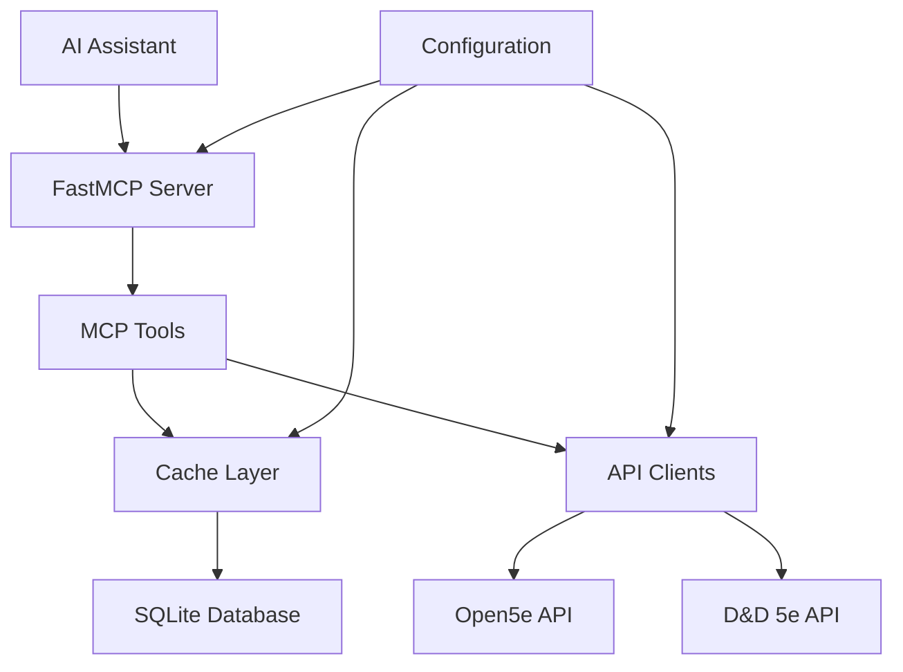

# Architecture Documentation

This document describes the architecture and design decisions behind the LoreKeeper MCP project.

## Table of Contents

- [Overview](#overview)
- [Architecture Principles](#architecture-principles)
- [System Architecture](#system-architecture)
- [Component Design](#component-design)
- [Data Flow](#data-flow)
- [Design Decisions](#design-decisions)
- [Performance Considerations](#performance-considerations)
- [Scalability Considerations](#scalability-considerations)
- [Security Considerations](#security-considerations)

## Overview

LoreKeeper is a Model Context Protocol (MCP) server that provides AI assistants with access to comprehensive Dungeons & Dragons 5th Edition data. The system is designed around performance, reliability, and maintainability principles.

### Key Requirements

- **Fast Response Times**: AI assistants need quick access to game data
- **High Reliability**: System must be dependable for interactive sessions
- **Data Freshness**: Game data should be reasonably up-to-date
- **Extensibility**: Easy to add new data sources and tools
- **Type Safety**: Catch errors at development time rather than runtime

## Architecture Principles

### 1. Async-First Design

All I/O operations use async/await patterns to ensure non-blocking behavior:

```python
async def lookup_spell(name: str) -> dict[str, Any]:
    # Check cache first
    cached = await get_cached(cache_key)
    if cached:
        return cached

    # Fetch from API
    response = await http_client.get(url)
    data = response.json()

    # Cache for future use
    await set_cached(cache_key, data, "spell", ttl)
    return data
```

**Benefits**:
- Non-blocking I/O operations
- Better resource utilization
- Improved responsiveness
- Natural fit for FastMCP server model

### 2. Layered Architecture

The system follows a strict layered approach:

```
┌─────────────────────────────────────┐
│           FastMCP Server           │  ← MCP Protocol Layer
├─────────────────────────────────────┤
│         MCP Tools Layer           │  ← Business Logic Layer
├─────────────────────────────────────┤
│        API Client Layer           │  ← External Integration Layer
├─────────────────────────────────────┤
│         Cache Layer               │  ← Data Persistence Layer
├─────────────────────────────────────┤
│      Configuration Layer          │  ← Infrastructure Layer
└─────────────────────────────────────┘
```

**Benefits**:
- Clear separation of concerns
- Testability in isolation
- Easy to modify individual layers
- Consistent interfaces between layers

### 3. Cache-First Strategy

The system prioritizes cached data over fresh API calls:

```python
async def get_data(key: str) -> dict[str, Any]:
    # Always check cache first
    cached = await cache.get(key)
    if cached:
        return cached

    # Only fetch from API if cache miss
    fresh_data = await fetch_from_api(key)
    await cache.set(key, fresh_data, ttl)
    return fresh_data
```

**Benefits**:
- Dramatically reduced API latency
- Lower API rate limiting impact
- Better offline capability
- Reduced external dependency risk

### 4. Type Safety with Pydantic

All configuration and data structures use Pydantic models:

```python
class Settings(BaseSettings):
    db_path: Path = Field(default=Path("./data/cache.db"))
    cache_ttl_days: int = Field(default=7, ge=1, le=365)

class Spell(BaseModel):
    name: str
    level: int = Field(ge=0, le=9)
    school: Literal["abjuration", "conjuration", ...]
```

**Benefits**:
- Compile-time error detection
- Automatic validation
- IDE support and autocomplete
- Self-documenting code

## System Architecture

### Component Interaction



### Data Flow Patterns

#### 1. Cache Hit Flow
```
AI Request → MCP Tool → Cache Check → Return Cached Data → AI Response
```

#### 2. Cache Miss Flow
```
AI Request → MCP Tool → Cache Check → API Call → Cache Storage → Return Data → AI Response
```

#### 3. Error Flow
```
AI Request → MCP Tool → Cache Check → API Error → Cache Error → Return Error Message → AI Response
```

## Component Design

### FastMCP Server Layer

**Responsibilities**:
- MCP protocol handling
- Tool registration and discovery
- Request routing
- Lifecycle management

**Key Design Decisions**:
- Use FastMCP framework for MCP compliance
- Async context manager for resource lifecycle
- Centralized error handling

```python
@asynccontextmanager
async def lifespan(app: Any) -> AsyncGenerator[None]:
    await init_db()  # Initialize database
    yield
    # Cleanup resources if needed

mcp = FastMCP(
    name="lorekeeper-mcp",
    version="0.1.0",
    lifespan=lifespan,
)
```

### MCP Tools Layer

**Responsibilities**:
- Implement specific lookup functionality
- Parameter validation
- Response formatting
- Cache integration

**Tool Categories**:
- `lookup_spell`: Spell information
- `lookup_creature`: Monster/creature stat blocks
- `lookup_character_option`: Classes, races, backgrounds, feats
- `lookup_equipment`: Weapons, armor, magic items
- `lookup_rule`: Rules, conditions, references

**Design Pattern**:
```python
@mcp.tool()
async def lookup_spell(
    name: str | None = None,
    level: int | None = None,
    school: str | None = None,
    # ... other parameters
) -> str:
    """Search and retrieve spell information."""

    # Build cache key
    cache_key = build_cache_key("spell", name, level, school, ...)

    # Check cache
    cached = await get_cached(cache_key)
    if cached:
        return format_spell_response(cached)

    # Fetch from API
    api_data = await fetch_from_open5e("spells", params)

    # Cache results
    await set_cached(cache_key, api_data, "spell", ttl)

    return format_spell_response(api_data)
```

### API Client Layer

**Responsibilities**:
- HTTP communication with external APIs
- Request/response handling
- Error handling and retry logic
- Response normalization

**Design Considerations**:
- Separate clients for each API (Open5e, D&D 5e)
- Consistent interface across different APIs
- Automatic retry with exponential backoff
- Rate limiting awareness

```python
class Open5eClient:
    def __init__(self, base_url: str, http_client: httpx.AsyncClient):
        self.base_url = base_url
        self.client = http_client

    async def get_spells(self, **params) -> dict[str, Any]:
        """Fetch spells from Open5e API."""
        url = f"{self.base_url}/v2/spells/"
        response = await self.client.get(url, params=params)
        response.raise_for_status()
        return response.json()
```

### Cache Layer

**Responsibilities**:
- Data persistence and retrieval
- TTL management
- Cache invalidation
- Performance optimization

**Database Schema**:
```sql
CREATE TABLE api_cache (
    cache_key TEXT PRIMARY KEY,
    response_data TEXT NOT NULL,
    created_at REAL NOT NULL,
    expires_at REAL NOT NULL,
    content_type TEXT NOT NULL,
    source_api TEXT NOT NULL
);

CREATE INDEX idx_expires_at ON api_cache(expires_at);
CREATE INDEX idx_content_type ON api_cache(content_type);
```

**Performance Optimizations**:
- WAL mode for concurrent access
- Indexes on frequently queried columns
- Connection pooling
- Batch operations for cleanup

### Configuration Layer

**Responsibilities**:
- Environment variable handling
- Default value management
- Validation
- Type conversion

**Design Features**:
- Pydantic Settings for automatic validation
- Environment file support
- Type-safe configuration
- Runtime configuration validation

## Design Decisions

### 1. SQLite vs. External Cache

**Decision**: Use SQLite instead of Redis or other external caches

**Rationale**:
- No external dependencies
- Persistent across restarts
- ACID compliance for data integrity
- Excellent Python support with aiosqlite
- Sufficient performance for use case
- Easy backup and migration

### 2. API Selection Strategy

**Decision**: Prefer Open5e API, use D&D 5e API as fallback

**Rationale**:
- Open5e has more comprehensive data
- Better structured responses
- Includes community content
- D&D 5e API needed for rules (not available in Open5e)
- Reduces complexity by using single primary API per category

### 3. TTL Values

**Decision**: 7 days for normal data, 5 minutes for errors

**Rationale**:
- Game data changes infrequently (new books, errata)
- 7 days balances freshness with performance
- Errors should be cached briefly to allow quick recovery
- Manual cache invalidation available if needed

### 4. Async vs. Sync

**Decision**: Full async implementation

**Rationale**:
- Natural fit for I/O-bound operations
- Better resource utilization
- FastMCP server is async-based
- Future scalability for concurrent requests
- Modern Python best practices

### 5. Type Safety Level

**Decision**: Strict type checking with MyPy

**Rationale**:
- Catch errors at development time
- Better IDE support
- Self-documenting code
- Easier refactoring
- Reduced runtime errors

## Performance Considerations

### Cache Performance

**Optimizations**:
- WAL mode for concurrent reads/writes
- Indexes on expiration and content type
- Connection pooling
- Efficient cache key generation

**Metrics to Monitor**:
- Cache hit ratio (target: >80%)
- Average cache retrieval time
- Database size growth
- Cleanup operation frequency

### API Performance

**Optimizations**:
- HTTP/2 support with httpx
- Connection pooling
- Request timeout configuration
- Retry logic with exponential backoff

**Metrics to Monitor**:
- API response times
- Error rates
- Rate limiting encounters
- Timeout frequency

### Memory Usage

**Considerations**:
- Streaming large responses
- Efficient JSON parsing
- Connection pool sizing
- Cache size management

## Scalability Considerations

### Horizontal Scaling

**Current Limitations**:
- SQLite file-based storage (not suitable for multi-instance)
- In-process cache (no distributed caching)

**Future Enhancements**:
- PostgreSQL for multi-instance deployments
- Redis for distributed caching
- Load balancer support
- Container orchestration

### Vertical Scaling

**Current Capabilities**:
- Async I/O for concurrent requests
- Efficient caching reduces load
- Lightweight Python runtime

**Optimization Opportunities**:
- CPU profiling for bottlenecks
- Memory usage optimization
- Database query optimization

## Security Considerations

### Current Security Measures

**Input Validation**:
- Pydantic model validation
- Type checking
- Parameter sanitization

**Data Protection**:
- No sensitive data in cache
- Environment variable configuration
- No hardcoded credentials

### Future Security Enhancements

**API Security**:
- API key management
- Rate limiting
- Request signing

**Data Security**:
- Encryption at rest
- Secure cache key generation
- Audit logging

**Network Security**:
- HTTPS enforcement
- Certificate validation
- Proxy support

## Architecture Evolution

### Phase 1: Current Implementation
- Single-instance SQLite cache
- Basic MCP tools
- Open5e + D&D 5e API integration

### Phase 2: Enhanced Features
- Additional data sources
- Advanced search capabilities
- Real-time data synchronization

### Phase 3: Production Scaling
- Multi-instance support
- Distributed caching
- Load balancing
- Monitoring and observability

### Phase 4: Advanced Features
- Machine learning integration
- Predictive caching
- Advanced analytics
- Custom data sources

This architecture provides a solid foundation for the current requirements while allowing for future growth and enhancement.
